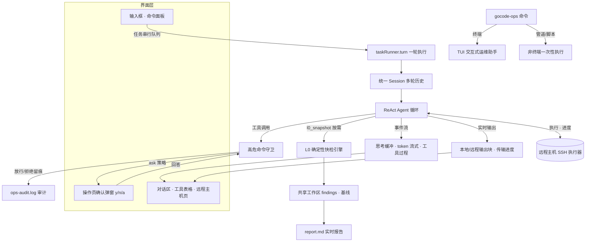

> **⚠️ 本仓库已归档（archived）** — 项目已更名为 **gocel-ops**，代码迁移至新仓库：
> **[go-gocel/gocel-ops](https://github.com/go-gocel/gocel-ops)**。请前往新仓库获取最新代码与后续更新。
# gocode-ops

面向 Linux 运维/实施/部署场景的 AI 助手 CLI——**一个产品、两种形态、一个公用内核**：

- **交互式运维助手**（默认，人在环形态）：TermAgent TUI 对话下达任务，高危命令执行前确认，
  本地/远程命令输出实时可见；非终端环境退化为一次性执行。
- **全自动运维引擎**（`auto` 子命令，自主形态）：无人值守的协议驱动巡检/排障引擎
  （快检 → 追查 → 处置 → 实时报告），退出码 + `result.json` 可机器评分；
  遗留的未处置项/人工工单可**接力**给交互助手接管。

两种形态共享同一套**公用内核**（`internal/common`）——L0 确定性快检、findings 三态、
守卫/审计、远程执行、记忆/认知、统一 Agent 装配与处置执行器；差异只在驱动模式
（人在环 vs 自主决策）。

## 核心特性

- **人在环安全**：高危命令机械守卫（非提示词约束），`ask`/`allow`/`deny` 策略，
  放行/拒绝全量写入 `ops-audit.log` 审计；
- **远程运维工具族**：SSH/SFTP 单机/批量/上传/下载/复制，输出实时可见、
  断点续传 + 字节校验；凭证只存本机、模型永远不可见；
- **确定性底座**：L0 快检（CPU/内存/磁盘/inode/僵尸进程/失败服务/错误日志/
  安全事实/配置漂移）+ findings 三态 + 多轮基线——只产线索不产结论；
- **记忆与认知**：经验库 + 主机档案（越用越懂）、认知作战图（workbench）；
- **无人值守**：协议骨架（survey → deepdive → respond → 复扫 → 终裁）+
  并行子代理 + watch 常驻守护（复发自动重新处置）；
- **接力协同**：引擎遗留由交互助手接管；两形态可并行使用同一工作目录
  （跨进程锁 + 状态合并）。

## 快速开始

```bash
gocode-ops init                                     # 生成 .gocode/ 配置目录
DEEPSEEK_API_KEY=... gocode-ops "巡检系统健康"       # 交互 TUI
DEEPSEEK_API_KEY=... gocode-ops auto --timeout 2h   # 全自动运维引擎
```

> 可选：把主题 JSON 放到 `.gocode/theme.json` 或用 `--theme <文件>` 自定义
> TUI 配色（加载失败自动回退内置主题）。

完整使用手册见 `cmd/gocode-ops/helper.md`（随二进制内置，`init` 时释放到
工作目录）。

## 交互式运维助手工作流程



`gocode-ops [任务...]` 是一条操作员在环的单向闭环，全程如下：

1. **装配**：解析工作目录与高危策略，构建模型与 TUI 组件树（对话/工具调用/
   远程主机三页 + 输入框 + 命令面板）。工作目录已 `init` 时同步构建 L0 共享
   底座（确定性快检引擎）并后台预热；`.gocode/hosts.yaml` 清单驱动远程
   执行器——凭证只存本机，模型永远不可见。
2. **提交**：输入框任务进入串行队列（Ctrl+C 中断当前任务并清空队列；内置
   命令 /new /hosts /tokens /export /exit 不入队直接执行）。流式阶段对话区按 Raw
   渲染，一轮结束后切回 Rich 全量渲染（代码高亮/表格）。
3. **执行**：ReAct agent 循环（思考 → 工具 → 观察）经统一 Session 运行，
   事件实时回传界面——思考段缓冲成引用块、token 逐字上屏、工具调用/结果
   进对话区与工具表格；本地命令与远程输出块实时可见（单工具 4000 字符
   预算防刷屏），上传/下载在表格显示百分比。
4. **人在环**：高危命令经机械守卫拦截（非提示词约束）——ask 策略逐条弹
   确认（y/n，a=本会话全部放行），allow/deny 一键放行/拒绝；ask_operator
   提问在界面内应答，支持自定义补充说明，取消即拒绝。全部放行/拒绝均
   写入 ops-audit.log 审计。
5. **L0 底座**：模型按需调用 l0_snapshot 确定性快检（CPU/内存/磁盘/inode/
   僵尸进程/失败服务/错误日志/安全事实/配置漂移），线索写入共享工作区
   （findings 三态/基线）并注入本轮上下文——纯知识问答零开销。报告按需
   生成：操作员明确要求时模型调用 generate_report 工具渲染 report.md，
   日常任务不主动生成（交互过程在操作员手里；全自动引擎的报告由引擎
   每轮自动渲染）。
6. **收尾**：恢复状态栏与渲染，失败/中断收尾悬挂的工具行（区分
   "已中断/失败"），自动执行下一条排队任务；token 用量累计显示在头部。

非终端环境（管道/脚本）退化为一次性执行：回答走 stdout、过程走 stderr，
ask 策略下高危命令一律拒绝（无确认通道）。全自动运维引擎（auto 子命令）是
独立入口，不经过 TUI，与交互式运维助手只共用 common 内核。

## 项目结构

```text
cmd/gocode-ops/        CLI 层：命令树 + TUI + 非终端模式 + 两形态启动装配
internal/common/       公用内核（两种形态的单一来源，每模块一个目录）：
                       model（领域模型/接口）· env（环境探测）·
                       probe（探针判定/信号词表/期望偏差）·
                       collect（采集编排）· l0（L0 确定性快检引擎）·
                       workspace（工作区/报告）· guard（守卫）·
                       audit（审计）· remote（远程执行）·
                       memory（经验库/主机档案）· workbench（认知工作台）·
                       agent（统一装配）· session（执行模型）·
                       tools（工具集）· prompt（提示词构建块）·
                       fsutil（文件工具）· remediate（处置执行器）
internal/assistant/   交互形态独有：人在环装配（NewAgent）+ 交互提示词
internal/autopilot/   自主形态独有：协议骨架 + 收敛循环（依赖 common）
test/                 演练与验收工作区：drill/（混沌演练 chaos-r1/r2）·
                      ops/（日常验收）· work/（K8s 模拟演练）
docs/                 架构图与设计文档（docs/architecture-diagram.md）
```

依赖方向：`cmd → {assistant, autopilot} → common`，单向无环。
当前 `internal/common` 各包以 `alias.go` 做适配层别名（类型别名指向
同目录源包，仅保留实际使用的符号）。

## 开发

```bash
go build ./...   # 构建
go vet ./...     # 静态检查
go test ./...    # 测试
```

依赖的底层库均以正式版本从模块代理拉取：`gocel v0.1.0`（Agent 工具/会话
内核）、`gocel-core v1.0.0`（核心契约）、`termagent v0.1.0`（TUI）。
本地联调三个库时可在 `go.mod` 临时加 `replace` 指向同级本地目录
（`../gocel`、`../gocel-core`、`../TermAgent`），提交前移除。

## 文档

- `cmd/gocode-ops/helper.md` — 完整使用手册：命令行参数、`.gocode/` 配置
  文件、TUI 键位与内置命令、auto 引擎（并行/watch/期望状态/记忆/接力）、
  安全模型、工具与超时（随二进制内置，`init` 时释放到 `.gocode/helper.md`）；
- `docs/architecture-diagram.md` — 架构图：两形态挂载关系、autopilot 协议
  机制（协议骨架 + 收敛循环）、模块职责速览、关键架构决策。
