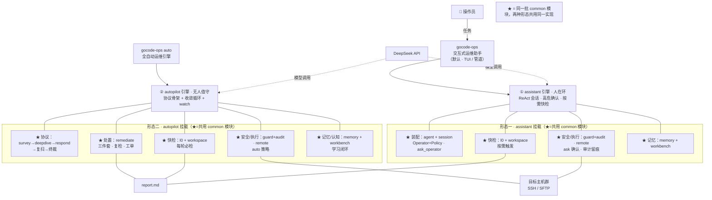
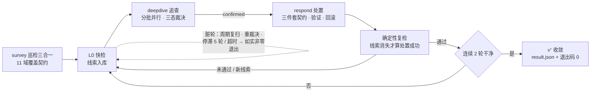

# gocode-ops 架构图

> 一个产品、两种形态、一个公用内核。两个入口各自走各自的引擎，引擎上挂载模块；
> ★ 标记的模块是同一批 common 模块，两种形态共用（差异只在装配参数与驱动方式）。

## 一、总体架构：两个入口 → 两个引擎 → 挂载模块

## 二、autopilot 引擎处理机制（协议骨架 + 收敛循环）

三个通用机制应对未知环境：**痕迹**（L0 只产线索不产结论，基线多轮趋势）、
**验证回路**（三态裁决 + 三件套契约 + 处置后复检，误报与假✓结构性排除）、
**安全**（守卫机械强制 + 审计留痕，不依赖模型自觉）。

## 三、模块职责速览

| 域 | 模块 | 提供的功能 |
|---|---|---|
| 入口 | `cmd/gocode-ops` | 命令树（TUI / init / auto）、模型构建、高危策略、两形态启动装配 |
| 形态 | `internal/assistant` | 交互形态独有：人在环装配（Operator+Policy 注入）、交互提示词、ask_operator |
| 形态 | `internal/autopilot` | 自主形态独有：协议骨架（survey→deepdive→respond→复扫→终裁）、收敛循环、并行 worker、watch |
| 领域 | `common/model` | 纯领域模型与消费方接口（Finding 三态 / Disposition / Operator / L0Snapshooter…） |
| 发现 | `common/env` · `common/probe` · `common/collect` | 环境探测裁剪、探针规格与判定（Judge/信号词表/期望偏差）、多主机并行采集与缓存 |
| 确定性层 | `common/l0` | L0 快检引擎：采集→判定→漂移→线索→基线→事实；按需（助手）/每轮（引擎）双入口 |
| 状态 | `common/workspace` | 工作区持久化（findings 三态 / 基线 / 阶段记录）+ report.md 渲染 |
| 安全 | `common/guard` · `common/audit` | 高危命令守卫（四策略 + 自影响审查）+ 审计日志（全量留痕、凭证脱敏） |
| 执行 | `common/remote` | SSH/SFTP 执行器（凭证零泄露）、remote_* 工具族、实时进度 |
| 智能 | `common/agent` · `common/session` · `common/tools` · `common/prompt` | 统一装配、统一执行模型（初始指令→工作）、工具集（含认知工具族）、提示词构建块 |
| 记忆 | `common/memory` · `common/workbench` | 经验库 + 主机档案（越用越懂）、认知作战图（假设/待验证） |
| 处置 | `common/remediate` | 三件套契约执行/验证/回滚、幂等预检、自通道校验、确定性复检、人工工单——两种形态共用的处置能力 |
| 工具 | `common/fsutil` | 原子写文件与截断（单一来源，收敛了 4 个包的重复副本） |

## 四、关键架构决策

1. **一种产品两种形态**：TUI 与 auto 完全隔离，只共用 `common` 内核；差异仅靠 AgentConfig 表达（工具集/提示词/策略），装配与执行模型（agent + session）统一。
2. **共享事实源**：`workspace.Workspace` + 同一份 `report.md` 跨形态延续；`l0.Engine` 同时服务"按需快检"与"每轮必检"（同一条代码路径）。
3. **安全机械强制**：workspace 文件边界 + 高危守卫（非提示词约束）+ 全量审计；远程凭证只存本机、模型永不可见。
4. **处置能力公用化**：三件套契约执行/复检/工单在 `remediate`——交互形态未来可接入同一处置通道（操作员批准后自动执行修复）。
5. **依赖单向无环**：`model ← env/probe/remote/guard/audit/memory/workbench/workspace ← collect ← l0 ← agent/tools ← {assistant, autopilot} ← cmd`。
